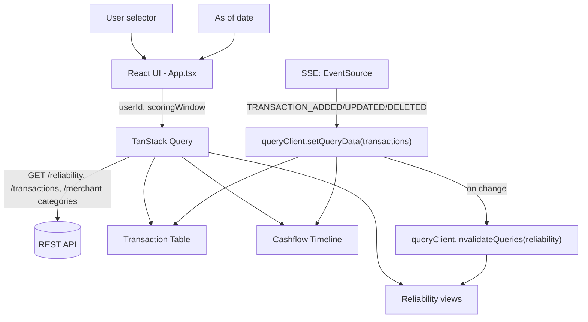

# Reliability Index Explorer

An internal-style frontend tool for exploring a user's Reliability Index, transactions, cashflow, and the score drivers behind the score. It lets you pick a user and an "as of" date, then browse the derived six-month scoring window, the reliability score breakdown, and the underlying transaction history — including live updates as new transactions arrive.

## Getting Started

**Prerequisites**: Node.js 20+ and npm.

```bash
npm install
npm run dev       # start the Vite dev server
npm run build     # type-check (tsc -b) and build for production
npm run lint      # run ESLint
npm run preview   # preview the production build locally
```

There is no local backend to run. The app connects directly to a hosted REST API and a hosted SSE (Server-Sent Events) endpoint for real-time transaction updates — both are already deployed and reachable as soon as you start the dev server.

## Environment Variables

No environment variables are currently required. The API base URL and SSE endpoint URL are defined as constants in `src/api/constants.ts` (`API_BASE_URL`, `SSE_BASE_URL`), not read from environment configuration.

## Tech Stack

- React
- TypeScript
- Vite
- TanStack Query
- Tailwind CSS
- @tanstack/react-virtual
- Lucide React

## Features

- **User selector** — a native `<select>` listing the fixed user pool `user_1001`–`user_1010`.
- **As of date** — a native `<input type="date">` driving which point in time the app scores against.
- **Derived scoring window** — a read-only six-month window computed from the "as of" date (`getScoringWindow`); it is never directly editable.
- **Reliability Overview** — the overall reliability index and score band, shown with a gauge.
- **Key Metrics** — the individual metrics behind the score (income regularity, coverage ratio, essential payment consistency, good months, negative balance days, late fee events).
- **Score Drivers** — the positive and risk adjustments reported by the API, grouped and annotated with their point values.
- **Score Breakdown** — a signal-by-signal breakdown showing how the individual metrics and adjustments combine into the final index.
- **Transaction Explorer** — a filterable, sortable, virtualized transaction table with merchant search (debounced), category and type filters, a "Clear filters" action, and per-row debit/credit styling.
- **Cashflow Timeline** — a monthly income/outflow/net breakdown for the scoring window, plus a summary row totaling the whole period.
- **Real-time SSE transaction updates** — transactions added, updated, or deleted on the backend are reflected live without a manual refresh.
- **Loading, error, and empty states** — skeleton placeholders while data loads, a clear error message with a Retry action on failure, and a distinct empty state when filters return no results.

## Architecture

The app separates three kinds of state:

- **Server state** — reliability data, transactions, and merchant categories are all owned by TanStack Query (`useReliability`, `useTransactions`, `useMerchantCategories`). Components never fetch directly; they read from query hooks.
- **UI state** — local `useState` in `App.tsx` (selected user, selected date) and in the view components (filter values, sort field/direction, debounced search) that never needs to be shared outside its component tree.
- **Derived data** — values computed from server state rather than fetched or stored, e.g. the filtered/sorted transaction list (`useMemo` in `TransactionsView`/`TransactionTable`) and the monthly cashflow breakdown (`getMonthlyCashflow` in `CashflowTimeline`).

**Main data flow:**

```
API → TanStack Query cache → UI components / derived views
```

**SSE flow:**

```
SSE event → setQueryData for the transactions query → derived views (table, cashflow) update
         → invalidate the reliability query → backend recalculates reliability on next fetch
```



## Key Implementation Details

- **Query keys & staleTime** — `['reliability', userId, from]` (5 min stale time), `['transactions', userId, from, to]` (5 min), `['merchant-categories']` (1 hour). Changing the user or date naturally produces a new query key, so TanStack Query handles cache switching and refetching without any manual invalidation logic.
- **Client-side filtering and sorting** — category, type, and merchant-search filtering, and date/amount sorting, all happen client-side over the already-fetched transaction list, memoized with `useMemo` to avoid recomputing on unrelated re-renders.
- **Virtualization** — the transaction table uses `@tanstack/react-virtual` to render only the visible rows, keeping the table responsive with large transaction lists.
- **Six-month scoring window** — derived from the selected date via `getScoringWindow`, a pure function; the window is always six calendar months ending on the selected date.
- **Reliability Index calculation** — the reliability index, score band, and metrics are calculated entirely by the backend API; the frontend only displays and visualizes the returned values (score gauge, breakdown, driver parsing) — it does not compute the score itself.
- **Cashflow Timeline** — derived client-side from the same transaction list already loaded for the table (`getMonthlyCashflow`), bucketing by month and summing income/outflow/net; no separate API call.
- **SSE event handling** — `TRANSACTION_ADDED`, `TRANSACTION_UPDATED`, and `TRANSACTION_DELETED` events each patch the transactions query cache directly via `setQueryData` (add/replace/remove in place), and any actual change triggers an invalidation of the reliability query so it refetches the updated score.
- **Responsive UI** — filter rows, the cashflow summary and monthly cards, and the page header all use Tailwind's responsive utilities to reflow at smaller widths; the transaction table scrolls horizontally within its own container rather than the page.

## Assumptions

- The user pool is fixed to `user_1001`–`user_1010`, per the API documentation, and is hardcoded client-side rather than fetched from an endpoint.
- API dates are plain `YYYY-MM-DD` strings; date-range and month-bucketing logic relies on these being safely comparable as strings.
- `score_band` (`HIGH`/`MEDIUM`/`LOW`) returned by the API is treated as authoritative and is never recomputed on the client.
- Score drivers arrive as free-text strings (e.g. `"On-time essential payments +10 pts"`); the associated point value is extracted with a regular expression rather than being a separate structured field.

## Technical Trade-offs

- **Tailwind CSS v4** via `@tailwindcss/vite`, with no `tailwind.config.js` and no custom theme tokens — quick to set up for a project of this scope, at the cost of not having a dedicated design-token layer.
- **`ScoreGauge` uses a CSS `conic-gradient`** rather than SVG or a charting library — lightweight and dependency-free, though less flexible if animation or richer interactivity were needed later.
- **Cashflow comparison bars are plain CSS divs** scaled by each month's income/outflow, instead of a charting library — keeps the bundle small and avoids a new dependency, at the cost of a simpler visual than a real chart would offer.
- **No global state library** — server state lives entirely in TanStack Query, and UI state is local `useState`; this keeps the app simple at its current size but would need revisiting if state had to be shared across more distant parts of the tree.
- **SSE updates the query cache directly** (`setQueryData`) instead of refetching on every event — avoids unnecessary network calls, but ties the SSE handler to the exact shape of the transactions response.
- **The transactions query key is defined in two places** — once in `useTransactions.ts` and once inline in `useTransactionEvents.ts` — so the SSE hook can patch the correct cache entry without importing the query hook itself; this is simple but means the two definitions have to be kept in sync by hand.

## Known Limitations

- No automated tests and no CI configuration exist yet.
- SSE reconnect is handled by the browser's native `EventSource` behavior; there is no visible connection/reconnect status indicator in the UI.
- There is no built-in way, from within the app, to generate a large (~10,000) transaction dataset for testing — this was verified manually during development rather than via a repeatable in-app tool.
- The transactions query key is duplicated between `useTransactions.ts` and `useTransactionEvents.ts` (see Trade-offs above), which is a minor maintenance risk if one is changed without the other.

## AI Usage

This project was developed with AI assistance used transparently as part of the workflow:

- Requirements and architecture decisions were analyzed and discussed with ChatGPT during planning.
- Claude Code was used as an implementation agent for parts of the UI work (styling passes, filters, table accessibility, loading/error/empty states, the Cashflow Timeline polish) and for drafting this documentation.
- All AI-assisted changes were reviewed, and verified with `npm run lint` and `npm run build`, plus manual checks of the affected behavior.
- Final architecture and implementation decisions were reviewed by the developer; the project is not fully AI-generated.

## Verification

- `npm run lint` — passes with 0 errors. One pre-existing warning remains in `TransactionTable.tsx`, related to React Compiler skipping memoization for `@tanstack/react-virtual`'s `useVirtualizer` (a known incompatibility between the compiler and this library's API shape, not a bug in this codebase).
- `npm run build` — passes (`tsc -b && vite build`) with no type errors.
- Transaction table virtualization was manually tested with approximately 10,000 transactions during development to confirm scroll performance held up at that scale.
